# eSIM-Tools 项目指导文件

> 专为 Giffgaff 和 Simyo 用户设计的 eSIM 管理工具集
> 版本: 2.0.0 | Node: >=18.0.0 | 部署平台: Netlify

---

## 1. 基础检索（交叉验证策略）

### 核心原则
- **禁止基于假设（Assumption）回答**，所有结论必须有代码依据
- **交叉检索强制执行**：必须同时调用 `mcp__ace-tool__search_context` + `mcp__fast-context__fast_context_search`，对比结果取交集

### 工具调用顺序
1. **先用 `mcp__ace-tool__search_context`** — 语义代码搜索，自然语言查询
2. **再用 `mcp__fast-context__fast_context_search`** — 补充检索，返回文件+行号+grep关键词
3. **对比两个工具的结果** — 取交集作为可靠上下文
4. **若结果不一致** — 增加检索深度（max_turns）或调整查询词重新检索

### 使用场景优先级

**必须用 fast_context_search 的场景**：
- 探索性搜索（不确定代码所在文件或目录）
- 用自然语言描述要找的逻辑（如"XX部署流程"、"XX事件处理"）
- 理解业务逻辑和调用链路
- 跨模块、跨层级查询（如从 router 追到 service 再到 model）
- 新任务开始前的代码调研和架构理解
- 中文语义搜索（工具支持中英文双语查询）

**根据需求选择工具**：
| 场景 | 首选工具 | 说明 |
|------|----------|------|
| 语义搜索 / 不确定位置 | `fast_context_search` | 返回文件+行号范围+grep关键词建议 |
| 精确关键词搜索 | Grep | 精准定位已知标识符 |
| 已知文件路径，查看内容 | Read | 直接读取文件内容 |
| 按文件名模式查找 | Glob | 模式匹配文件名 |
| 编辑已有文件 | Edit | 局部修改 |
| 提示词增强 | `mcp__ace-tool__enhance_prompt` | 优化任务描述以获得更精准结果 |

### 参数调优指南
- `tree_depth=1, max_turns=1` — 快速粗查，适合小项目或初步定位
- `tree_depth=3, max_turns=3`（默认）— 平衡精度与速度，适合大多数场景
- `max_turns=5` — 深度搜索，适合复杂调用链追踪
- `project_path` — 指定搜索的项目根目录，默认为当前工作目录

### 完整性检查
- 必须获取相关类、函数、变量的**完整定义与签名**
- 若上下文不足，增加 `max_turns` 参数进行递归检索直至信息完整
- 若两个工具结果不一致，需增加检索深度或调整查询词重新检索

### 需求对齐
- 若检索后需求仍有模糊空间，必须向用户输出引导性问题列表
- 直至需求边界清晰（无遗漏、无冗余）

---

## 2. 网络检索（Smart Search CLI）

### 激活条件
**触发场景**：网络搜索 / 网页抓取 / 最新信息查询 / 事实核查 / 官方文档查询
**首选工具**：`smart-search-cli` 作为默认搜索执行层

### 工具路由矩阵

| 场景 | 首选命令 | 说明 |
|------|----------|------|
| 广度探索 / 实时综合 | `smart-search search "query" --format json` | 主搜索入口，自动路由到配置的提供商 |
| 中文搜索 / 国内资讯 / 政策法规 | `smart-search zhipu-search "query" --format json` | 智谱 Web Search API |
| 官方文档 / API / SDK 查询 | `smart-search context7-library/doc "query" --format json` | Context7 优先，Exa 补充 |
| 官方域名 / 论文 / 可信站点 | `smart-search exa-search "query" --format json` | 低噪声精准发现 |
| 抓取网页内容 | `smart-search fetch "url" --format markdown` | Tavily 优先，Firecrawl 兜底 |
| 站点结构探索 | `smart-search map "url" --format json` | 文档站结构分析 |
| 深度研究 / 多源验证 | `smart-search deep "question" --format json` | 离线规划 → 分步执行 → 证据收集 |

### 执行策略

**搜索构建**：
- 广度搜索：`search --extra-sources 1..3`（增加额外来源）
- 深度验证：`search --validation strict`（严格验证模式）
- 中文内容：`zhipu-search`（智谱 API 优化）
- 技术文档：`context7-library/doc`（官方文档优先）

**证据策略**（`fetch_before_claim`）：
1. **候选 URL 发现** — 使用 `search` / `exa-search` / `zhipu-search` / `context7-*`
2. **关键页面抓取** — 使用 `fetch` 获取完整内容
3. **交叉验证** — 多源对比，确认信息一致性

**结果整合**：
- 强制标注来源格式：`[标题](URL)`
- 区分 `primary_sources`（已验证）和 `extra_sources`（候选）
- 时间敏感信息必须注明日期

### 错误恢复

| 错误类型 | 处理方式 |
|----------|----------|
| 超时 | 重试 3 次 `--timeout 180`，间隔 5 秒 |
| 全部超时 | 降级到 `exa-search` + `fetch` 手动取证 |
| 无结果 | 放宽查询条件 / 切换提供商 |
| 配置异常 | `smart-search doctor --format json` 诊断 |

### 核心约束

✅ **必须做到**：
- 首选 smart-search-cli 作为网络搜索入口
- 输出必须包含来源引用
- 失败必须重试（最多 3 次）
- 关键信息必须验证

❌ **禁止行为**：
- 禁止无来源输出
- 禁止单次放弃
- 禁止未验证假设
- 禁止直接引用 `extra_sources` 作为证据

---

## 🧠 项目记忆管理

### 项目容器标签

**containerTag**: `esim-tools`

### 关键记忆点

#### 技术栈决策
- **无框架设计**：坚持原生 JavaScript，避免 React/Vue 依赖，保持最小打包体积
- **Serverless 架构**：Netlify Functions + Edge Functions，BFF 模式代理
- **原生 ES6 模块**：业务页面不经 Webpack 打包，浏览器原生加载

#### 踩坑记录
- **Giffgaff OAuth REDIRECT_URI**：环境变量只影响服务端 token exchange，前端授权 URL 由 `api-config.js` 独立控制
- **Netlify Free Plan 限制**：Functions 每月 125,000 次调用配额，避免前端轮询
- **Safari 隐私模式**：IndexedDB 会抛出 QuotaExceededError，需降级到 sessionStorage

#### 编码偏好
- 缩进：2 空格
- 引号：单引号优先
- 分号：必须使用
- 命名：camelCase（变量/函数），PascalCase（类），kebab-case（文件）

### 自动记忆触发

- 修改 OAuth/认证流程 → 检索 "OAuth PKCE 认证 零信任"
- 添加 Netlify Functions → 检索 "Functions 中间件 withAuth"
- 性能优化 → 检索 "性能 瓶颈 IndexedDB"
- 部署问题 → 检索 "Netlify 部署 环境变量"

---

## 变更记录

| 时间 | 变更内容 |
|------|----------|
| 2026-06-12 | 集成 Not-ace-memory 记忆管理系统 |
| 2026-06-02 22:54:25 | 增量扫描更新：为 src/giffgaff 和 src/simyo 新建 CLAUDE.md，修复模块结构图 click 链接，校正脚本数量 |
| 2026-05-25 | 清理 Legacy 残留措辞：删除 verify-legacy-frozen 工具链、修复 server.js 死路由 simyo-static、统一架构表述为"原生 ES6 模块" |
| 2026-05-18 | 文档清理与路径重构：移除未使用的新模块化版本，修复文档错链，精简重复文档 |
| 2026-05-03 22:11:20 | 增量扫描更新：重新扫描全仓，更新模块索引与覆盖率报告 |
| 2026-04-28 19:11:10 | 增量扫描更新：重新扫描全仓，更新模块索引与覆盖率报告 |
| 2025-12-11 | 初始扫描：完成全仓清点与文档生成 |

---

## 项目愿景

eSIM-Tools 是一个 JAMstack 架构的 Web 应用，为已有 Giffgaff 和 Simyo 号码的用户提供 eSIM 转换、设备更换和管理的完整工具链。项目采用无框架原生 JavaScript + Serverless 后端，通过 Netlify 全球边缘网络部署。

**生产环境**: https://esim.cosr.eu.org
**仓库地址**: https://github.com/Silentely/eSIM-Tools

---

## 架构总览

### 技术栈

| 层级 | 技术 | 用途 |
|------|------|------|
| **前端** | 原生 JavaScript (ES2021+) | 无框架设计，避免依赖和打包体积 |
| **后端** | Netlify Functions (Node.js) + Edge Functions (Deno) | Serverless API 和 BFF 代理 |
| **构建** | build-static + esbuild + PostCSS | 静态资源拷贝、browserslist 转译、压缩 |
| **部署** | Netlify (JAMstack) | 静态托管 + Serverless + Edge |
| **监控** | Sentry (前后端) | 错误追踪与性能监控 |
| **测试** | Jest 30.3.0 (jsdom) | 单元测试 |

### 关键架构决策

1. **无框架设计**: 使用原生 JavaScript 避免框架依赖，保持最小打包体积
2. **Serverless 优先**: 所有后端逻辑通过 Netlify Functions 实现
3. **BFF 模式**: Edge Functions 作为 Backend-For-Frontend 代理层，注入 ACCESS_KEY 并转发请求
4. **中间件统一**: 通过 `withAuth` 中间件统一处理鉴权、CORS、验证
5. **原生 ES6 模块**: 前端采用浏览器原生 ES6 模块化设计 (HTML + `<script type="module">` + `import/export`)，业务页面不经 Webpack 打包，按需加载，由 Netlify 静态托管直接派发

### 部署流程

```
本地开发 -> 构建静态资源 -> 部署到 Netlify
  npm run dev          (本地开发服务器 + 热重载)
  npm run build        (静态拷贝 + esbuild 转译到 dist/，非 Webpack)
  npm run check:links  (生产 HTML 本地资源脱链检查)
  npm run deploy       (部署到 Netlify 生产环境)
```

---

## 模块结构图

```mermaid
graph TD
    A["eSIM-Tools (根)"] --> B["src/giffgaff"];
    A --> C["src/simyo"];
    A --> D["src/js/modules (通用工具)"];
    A --> E["netlify/functions"];
    A --> F["netlify/edge-functions"];
    A --> G["scripts"];
    A --> H["tests"];
    A --> I["docs"];

    B --> B0["js/giffgaff-app.js - 主控制器"];
    B --> B1["js/modules/oauth-handler.js - OAuth PKCE"];
    B --> B2["js/modules/esim-service.js - eSIM 业务逻辑"];
    B --> B3["js/modules/state-manager.js - 状态管理"];
    B --> B4["js/modules/ui-controller.js - UI 控制"];
    B --> B5["js/modules/mfa-handler.js - MFA 验证"];
    B --> B6["js/modules/cookie-handler.js - Cookie 管理"];

    C --> C0["js/simyo-app.js - 主控制器"];
    C --> C1["js/modules/auth-handler.js - 登录认证"];
    C --> C2["js/modules/device-change-handler.js - 设备更换"];
    C --> C3["js/modules/esim-service.js - eSIM 服务"];

    D --> D1["logger.js / api-service.js"];
    D --> D2["notification-manager.js / notification-service.js"];
    D --> D3["html-sanitizer.js / secure-storage.js"];
    D --> D4["captcha-manager.js / i18n.js / i18n-data.js"];
    D --> D5["utils.js / performance-monitor.js / browser-utils.js"];
    D --> D6["config.js / app-config.js / footer.js"];

    E --> E1["giffgaff-token-exchange.js"];
    E --> E2["giffgaff-graphql.js"];
    E --> E3["giffgaff-mfa-challenge.js"];
    E --> E4["giffgaff-sms-activate.js"];
    E --> E5["giffgaff-mfa-validation.js"];
    E --> E6["auto-activate-esim.js"];
    E --> E7["verify-cookie.js"];
    E --> E8["health.js"];
    E --> E9["public-config.js"];
    E --> E10["notifications.js"];
    E --> E11["notifications-internal.js"];
    E --> E12["_shared/middleware.js"];
    E --> E13["_shared/internal-headers.js"];

    F --> F1["bff-proxy.js"];
    F --> F2["markdown-negotiation.js"];

    click B "./src/giffgaff/CLAUDE.md" "查看 Giffgaff 模块文档"
    click C "./src/simyo/CLAUDE.md" "查看 Simyo 模块文档"
    click D "./src/js/modules/CLAUDE.md" "查看通用工具模块文档"
    click E "./netlify/functions/CLAUDE.md" "查看 Functions 模块文档"
    click F "./netlify/edge-functions/CLAUDE.md" "查看 Edge Functions 模块文档"
    click G "./scripts/CLAUDE.md" "查看构建脚本文档"
    click H "./tests/CLAUDE.md" "查看测试文档"
```



---

## 模块索引

| 模块 | 路径 | 职责 | 语言 |
|------|------|------|------|
| **Giffgaff 前端** | `src/giffgaff/` | Giffgaff eSIM 管理流程 (OAuth/MFA/GraphQL) | JavaScript (ES6 Module) |
| **Simyo 前端** | `src/simyo/` | Simyo eSIM 管理流程 (登录/设备更换/激活) | JavaScript (ES6 Module) |
| **通用工具** | `src/js/modules/` | 可复用前端工具模块 (日志/存储/安全/性能/i18n) | JavaScript |
| **Netlify Functions** | `netlify/functions/` | Serverless 后端逻辑 (11 个函数) | JavaScript (Node.js) |
| **Edge Functions** | `netlify/edge-functions/` | BFF 代理层 (密钥注入 + 请求转发 + 内容协商) | JavaScript (Deno) |
| **构建脚本** | `scripts/` | 构建、质量检查、安全扫描 (22 个脚本) | JavaScript/Shell |
| **测试** | `tests/` | 单元测试 (Jest + jsdom) | JavaScript |
| **文档** | `docs/` | 使用指南、API 参考、修复记录 | Markdown |

---

## 运行与开发

### 环境要求

- Node.js >= 18.0.0
- npm >= 8.0.0

### 本地开发

```bash
# 1. 安装依赖
npm install

# 2. 配置环境变量
cp env.example .env
# 编辑 .env 填写 ACCESS_KEY 等

# 3. 启动开发服务器
npm run dev              # Express 服务器 (localhost:3000)
npm run netlify-dev      # Netlify Dev 完整模拟 (localhost:8888)
```

### 构建与部署

```bash
npm run build            # 静态拷贝 + esbuild 转译到 dist/
npm run check:links      # HTML 本地资源脱链检查（生产零脱链）
npm run quality-check    # 代码质量检查（含脱链检查）
npm run security-check   # 安全配置扫描
npm run deploy           # 部署到 Netlify 生产环境
```

### 测试

```bash
npm test                 # 运行所有测试
npm run test:watch       # 监听模式
npm run test:coverage    # 生成覆盖率报告
```

### 环境变量

关键环境变量 (参考 `env.example`):

| 变量 | 必填 | 说明 |
|------|------|------|
| `ACCESS_KEY` | 是 | Functions 访问密钥 (openssl rand -hex 32) |
| `ALLOWED_ORIGIN` | 是 | CORS 允许来源 (默认 https://esim.cosr.eu.org) |
| `GIFFGAFF_CLIENT_ID` | 是 | Giffgaff OAuth Client ID |
| `GIFFGAFF_CLIENT_SECRET` | 是 | Giffgaff OAuth Client Secret (Base64) |
| `CAPTCHA_PROVIDER` | 否 | 验证码提供商 (recaptcha/off，默认 off) |
| `SENTRY_DSN` | 否 | Sentry 错误监控 DSN |
| `NODE_ENV` | 否 | 环境 (development/production) |

---

## 测试策略

- **框架**: Jest 30.3.0 + jsdom 环境
- **覆盖率阈值**: 60% (branches/functions/lines/statements)
- **测试文件**: `tests/modules/`、`tests/giffgaff/`、`tests/simyo/` 和 `tests/security/`
- **Mock**: `tests/__mocks__/` (styleMock, fileMock)
- **运行**: `npm test` / `npm run test:coverage`

---

## 编码规范

- **缩进**: 2 空格
- **引号**: 单引号 (避免转义时允许双引号)
- **分号**: 必须使用
- **命名**: 类名 PascalCase, 变量/函数 camelCase, 常量 UPPER_SNAKE_CASE, 文件 kebab-case
- **Import 顺序**: Node 内置 -> 第三方依赖 -> 本地模块
- **严格模式**: 所有文件顶部 `'use strict'`
- **ESLint**: `eslint:recommended` + 自定义规则 (见 `.eslintrc.json`)

---

## AI 使用指引

1. **上下文检索优先级**: 开始任务或修改代码前，必须同时使用以下两个工具进行交叉检索：
   - `mcp__ace-tool__search_context` — 语义代码搜索
   - `mcp__fast-context__fast_context_search` — 代码上下文搜索
   - 两个工具必须都调用，对比结果取交集作为可靠上下文
   - 若结果不一致，需增加检索深度或调整查询词重新检索
2. **Giffgaff OAuth 的 `GIFFGAFF_REDIRECT_URI` 只影响服务端 token exchange**: 前端授权跳转仍由 `src/giffgaff/js/modules/api-config.js` 中的 `oauthConfig.redirectUri` 控制，Netlify 环境变量不会自动改写前端授权 URL
4. **修改 Functions 时**: 必须通过 `withAuth` 中间件包装 handler
5. **修改前端模块时**: 使用相对路径导入模块
6. **添加新 Function 时**: 在 `server.js` 中注册 Express 路由 (本地开发)
7. **测试变更时**: 运行 `npm test` 确保通过
8. **部署前**: 运行 `npm run quality-check && npm run security-check`

---

## 项目联系

- **仓库**: https://github.com/Silentely/eSIM-Tools
- **问题反馈**: https://github.com/Silentely/eSIM-Tools/issues
- **许可证**: MIT

---

## .context 项目上下文

> 项目使用 `.context/` 管理开发决策上下文。

- 编码规范：`.context/prefs/coding-style.md`
- 工作流规则：`.context/prefs/workflow.md`
- 决策历史：`.context/history/commits.md`

**规则**：修改代码前必读 prefs/，做决策时按 workflow.md 规则记录日志。
