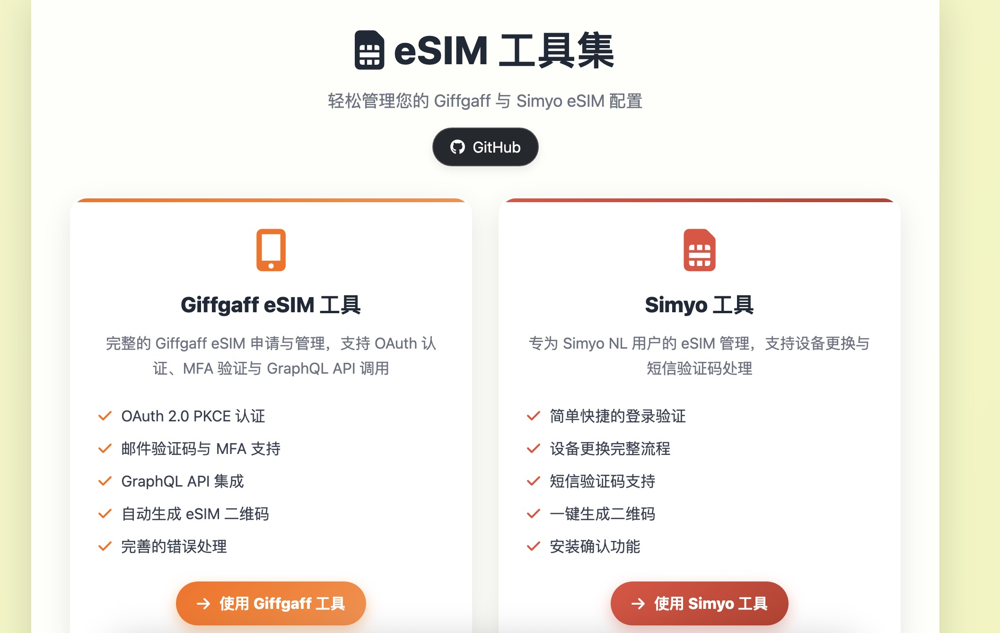
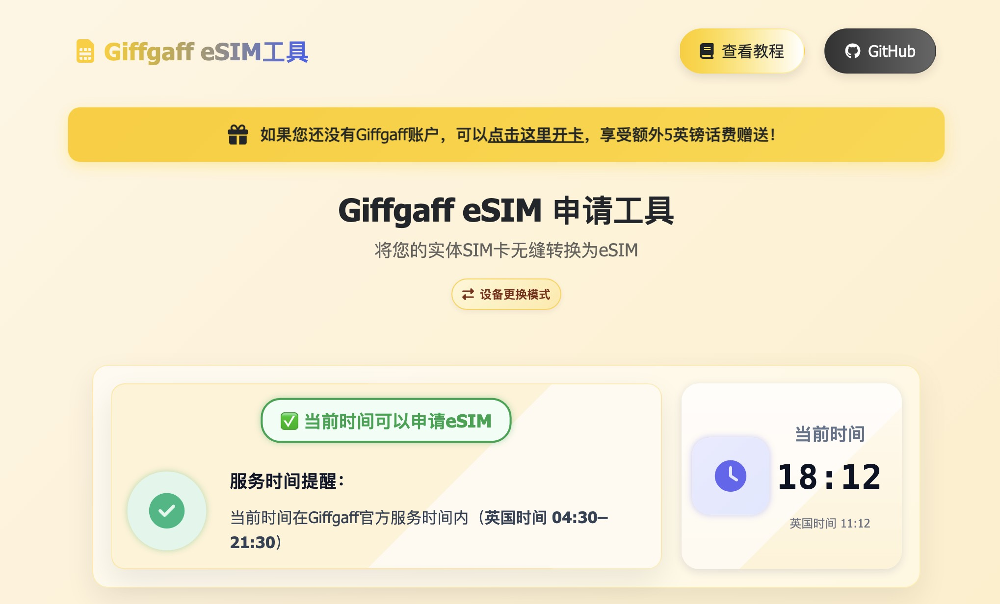
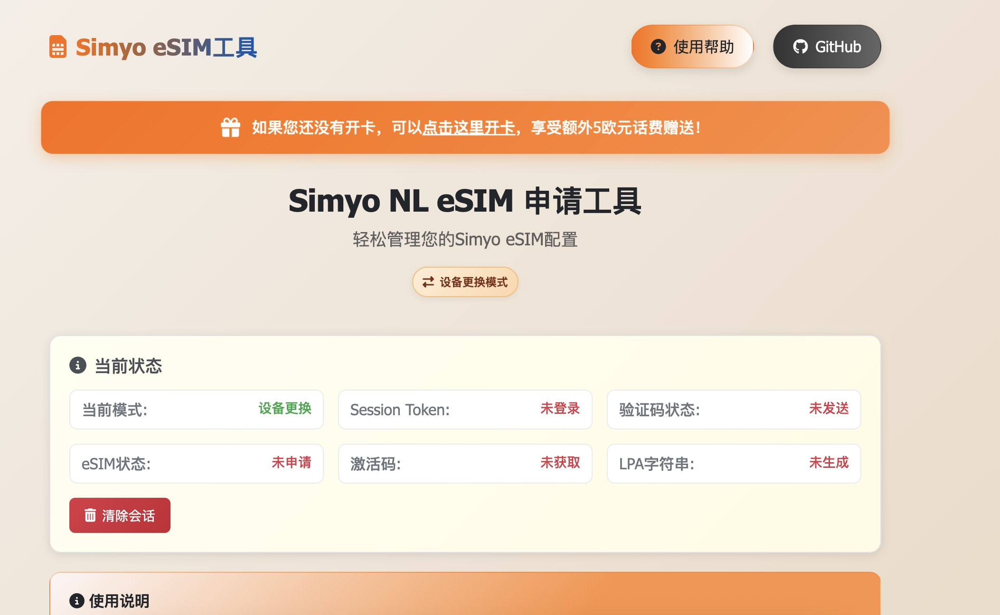

# eSIM Tools 🚀

Modern eSIM management toolkit designed for Giffgaff and Simyo users, supporting complete eSIM application, activation, and QR code generation processes.

[:cn: 中文版本](README.md)

## ✨ Features

### 🇬🇧 Giffgaff eSIM Tools
- **OAuth 2.0 PKCE Authentication** - Secure authentication flow
- **Smart Cookie Login** - Fast login without OAuth
- **MFA Multi-Factor Authentication** - Email/SMS verification code support
- **SMS Verification Activation** - Fully automatic eSIM application and activation (✅ Recommended)
- **GraphQL API Integration** - Complete API call chain
- **LPA QR Code Generation** - Standard eSIM activation code
- ~~**Manual Activation Guide**~~ - Discontinued on October 8, 2025

### 🇳🇱 Simyo eSIM Tools
- **Account Login Verification** - Dutch phone number format validation
- **Device Replacement Support** - Complete SIM card replacement process
- **SMS Verification Code** - Automatic sending and verification processing
- **Instant QR Code Generation** - One-click generation of scannable activation codes
- **Installation Confirmation** - Ensures eSIM is correctly activated

## 🖼️ Interface Preview

> Below are functional screenshots of the main pages for quick understanding of the tool interface and core operation paths.

### Home Page



### Giffgaff eSIM Tools



### Simyo eSIM Tools



## 🌐 Online Usage

### 🚀 Online Service (Recommended)
**Full Version**: [https://esim.cosr.eu.org](https://esim.cosr.eu.org)
- ✅ Supports all eSIM operations and processes
- ✅ Performance optimized, supports offline usage
- ✅ Regular updates and maintenance

### 🎁 New User Offers
- **Simyo Users**: New sign-ups enjoy [extra €5 credit](https://vriendendeal.simyo.nl/prepaid/AZzwPzb)
- **Giffgaff Users**: New sign-ups enjoy [extra £5 credit](https://www.giffgaff.com/orders/affiliate/mowal44_1653194386268)

## 📋 User Guide

### 🇬🇧 Giffgaff eSIM Application Process (Recommended: SMS Verification Activation)
1. **Authentication** - OAuth login or Cookie fast login
2. **Email/SMS Verification** - Enter received MFA verification code
3. **Get Member Information** - Automatically retrieve account information
4. **SMS Verification Activation** - Select "SMS Verification Activation" (Recommended)
   - Click "Send Verification Code"
   - Enter the 6-digit SMS verification code received
   - System automatically completes booking, exchange, and activation
5. **Get QR Code** - Automatically generates LPA activation code and QR code

> ✅ **Recommended SMS Verification Activation**: Fully automated process, no manual operation required
>
> ⚠️ **Discontinued Feature**: Manual activation method was officially fixed and discontinued by Giffgaff on October 8, 2025
>
> 📖 **Detailed Tutorial**: See [Giffgaff User Guide](./docs/reference/README_giffgaff_esim.md) for complete图文 and video operation guide

### 🇳🇱 Simyo eSIM Application Process
1. **Account Login** - Enter Dutch phone number (starting with 06) and password
2. **Select Service** - New application or device replacement
3. **Verification Code Processing** - SMS or customer service verification code verification
4. **Get Configuration** - System generates eSIM configuration information
5. **Scan to Install** - Use the generated QR code to install on new device

### 📚 Detailed Documentation
- **[Giffgaff User Guide](./docs/User_Guide.md)** | [中文版](./docs/User_Guide_EN.md)
- [Giffgaff Detailed Instructions](./docs/reference/README_giffgaff_esim.md) | [中文版](./docs/reference/README_giffgaff_esim_EN.md)
- [Simyo Detailed Instructions](./docs/reference/README_simyo_esim.md) | [中文版](./docs/reference/README_simyo_esim_EN.md)
- [Performance Optimization Guide](./docs/PERFORMANCE.md)

## 🚀 Local Deployment

### Quick Start

1. **Clone Repository**
   ```bash
   git clone https://github.com/Silentely/eSIM-Tools.git
   cd eSIM-Tools
   ```

2. **Install Dependencies**
   ```bash
   npm install
   ```

3. **Start Proxy Server**
   ```bash
   # Windows
   start_simyo_server.bat
   
   # macOS/Linux
   ./start_simyo_server.sh
   
   # Or manually start
   npm start
   ```

4. **Access Application**
   ```
   http://localhost:3000
   ```

### Requirements
- **Modern Browser**: Chrome 88+, Firefox 85+, Safari 14+, Edge 88+
- **Development Environment**: Node.js >= 18.0.0, npm >= 8.0.0 (only needed for local development)

## 🔧 Technical Architecture

### Frontend Tech Stack
- **HTML5/CSS3** - Responsive design, modern UI
- **JavaScript ES6+** - Modular architecture, modern syntax features
- **Bootstrap 5** - Responsive UI framework
- **Service Worker** - Offline support and cache optimization

### Backend Architecture
- **Production**: Netlify Functions - Serverless functions handling API proxy
- **Development**: Node.js Express - Local development server
- **CORS Handling** - Unified cross-origin request solution
- **Session Management** - Secure local storage and automatic expiration mechanism

### 🚀 Performance Optimization
- **Resource Compression**: Webpack + TerserPlugin, compression rate 65%+
- **Service Worker**: Offline caching and network status monitoring
- **Image Optimization**: WebP format support, automatic compression
- **Code Splitting**: Automatic separation of third-party libraries, reduced initial loading time

> Detailed performance optimization documentation can be found in [PERFORMANCE.md](./docs/PERFORMANCE.md)

### Service Time Information
- **Giffgaff Service Window**: UK Time 04:30 – 21:30 (Europe/London)
- **Operations Outside Window**: May fail or be unstable, UI displays local time compared to UK time

## 📦 Deployment Methods

### 🌟 Recommended: Online Service
Use hosted version [https://esim.cosr.eu.org](https://esim.cosr.eu.org)
- No deployment configuration needed, ready to use
- Automatic updates, stable and reliable
- Full feature support

### 🔧 Self-hosted: Netlify
1. Fork this repository to your GitHub account
2. Connect GitHub repository in [Netlify](https://app.netlify.com)
3. Build settings:
   - Build command: `echo 'No build needed'`
   - Publish directory: `.`
4. Deployment complete, get your custom domain

### ⚙️ Local Development
```bash
# Clone repository
git clone https://github.com/Silentely/eSIM-Tools.git
cd eSIM-Tools

# Install dependencies and start
npm install
npm start

# Access http://localhost:3000
```

## ❓ Frequently Asked Questions

### Giffgaff Related
**Q: Which activation method is recommended?**
A: Recommend using "SMS Verification Activation", fully automated process, just enter the SMS verification code to complete all steps.

**Q: How long does SMS verification activation take?**
A: Usually 1-2 minutes. Send verification code → Enter verification code → Automatically complete booking, exchange and activation → Get QR code.

**Q: Can manual activation still be used?**
A: Manual activation method was officially fixed and discontinued by Giffgaff on October 8, 2025. Please use SMS verification activation.

**Q: What if I accidentally close the page?**
A: After re-login, the system will continue from the recoverable node. It is recommended to keep the page open until activation is complete.

### Simyo Related
**Q: Which phone number formats are supported?**
A: Only Dutch phone numbers (10-digit numbers starting with 06).

**Q: What if I don't receive the verification code?**
A: You can choose the customer service verification code option, or check SMS blocking settings.

## ⚠️ Important Notes

### Scope of Application
- **Giffgaff**: UK users only
- **Simyo**: Netherlands users only (06 prefix phone numbers)

### Security and Privacy
- ✅ All data processing is done locally
- ✅ Does not store user credential information
- ✅ Recommended to use in secure network environment
- ✅ Open source and transparent, code auditable

## 📁 Project Structure

```
eSIM-Tools/
├── 📄 index.html                 # Main page
├── 🖥️ server.js                  # Local development server
├── 📦 package.json               # Project configuration
├── 📂 src/                       # Source code
│   ├── 🇬🇧 giffgaff/             # Giffgaff tools
│   ├── 🇳🇱 simyo/                # Simyo tools
│   ├── 🎨 styles/                # Style files
│   └── ⚙️ js/                    # JavaScript modules
├── 🌐 netlify/                   # Serverless functions
│   └── functions/                # API proxy
├── 📚 docs/                      # Project documentation
│   ├── guides/                   # User guides
│   ├── reference/                # Reference documents
│   └── fixes/                    # Issue fixes
├── 🧪 tests/                     # Test files
└── 🛠️ scripts/                   # Deployment scripts
```

### Cross-Origin Solutions
1. **🌟 Recommended**: Use online service [esim.cosr.eu.org](https://esim.cosr.eu.org)
2. **🔧 Netlify Functions**: Automatic API proxy
3. **💻 Local Proxy**: Node.js development server
4. **📖 Detailed Explanation**: [CORS Solution Document](./docs/guides/CORS_SOLUTION.md)

## 🧪 Testing

Project includes comprehensive test suite:
- **Unit Tests** - Core functions and modules testing
- **Integration Tests** - API calls and process testing
- **End-to-End Tests** - Complete user flow verification

```bash
# Run test suite
npm test

# Test in browser
open tests/test_giffgaff_esim.html
open tests/test_simyo_esim.html
```

## 🤝 Contribution Guidelines

Contributions and suggestions welcome!

### How to Participate
1. 🍴 Fork project repository
2. 🌿 Create feature branch (`git checkout -b feature/AmazingFeature`)
3. 💾 Commit changes (`git commit -m 'Add AmazingFeature'`)
4. 📤 Push branch (`git push origin feature/AmazingFeature`)
5. 🔃 Create Pull Request

### Development Standards
- Follow existing code style
- Add necessary test cases
- Update relevant documentation

## 📞 Support and Feedback

Having issues or suggestions?
- 📋 [Submit Issue](https://github.com/Silentely/eSIM-Tools/issues)
- 📖 View [Project Documentation](./docs/)
- 💬 Participate in community discussions

## 📄 License

- All code in this project, unless otherwise stated, is released under the [MIT License](LICENSE).
- README.MD, wiki and other resources of this project are based on [CC BY-NC-SA 4.0][CC-NC-SA-4.0] which means you can copy and redistribute the content of this project,<br/>
  but you must also **provide author information and license statement**. At the same time you **cannot use this project for commercial purposes**, according to our narrow interpretation<br/>
  (additional clause), any **profit-making activities are considered commercial use**.
- Please use this project in compliance with local laws and regulations.

## ⚖️ Disclaimer

This tool is for learning and personal use only. Please comply with relevant terms of service. The developer is not responsible for any problems arising from the use of this tool. Please use in compliance with local laws and regulations.

[github-hosts]: https://raw.githubusercontent.com/racaljk/hosts/master/hosts "hosts on Github"
[CC-NC-SA-4.0]: https://creativecommons.org/licenses/by-nc-sa/4.0/

<div align="center">
  <sub>Made with ❤️ by <a href="https://github.com/Silentely">Silentely</a></sub>
</div>