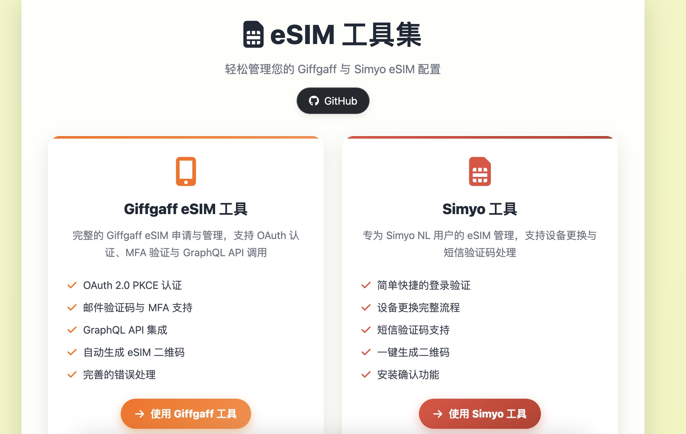
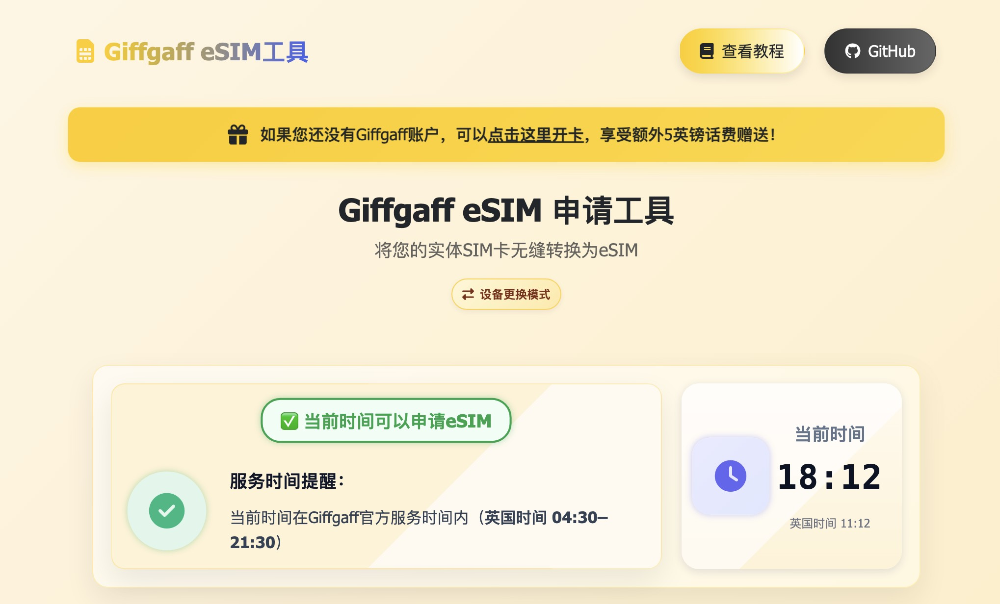
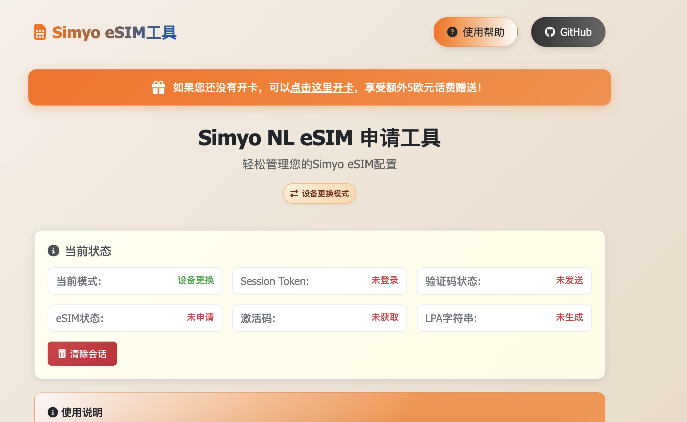

<div align="center">
<h1 align="center">eSIM Tools 🚀<br></img></h1>
</img>
<br>


<br>


<br>
</div>

A modern eSIM management toolkit for Giffgaff and Simyo users, supporting complete eSIM application, activation, and QR code generation workflows.

[:cn: 中文版本](README.md)

## ✨ Features

### 🇬🇧 Giffgaff eSIM Tools
- **OAuth 2.0 PKCE Authentication** - Secure authentication workflow
- **Smart Cookie Login** - Fast login without OAuth
- **MFA (Multi-Factor Authentication)** - Email/SMS verification code support
- **SMS Verification Activation** - Fully automated eSIM application and activation (✅ Recommended)
- **GraphQL API Integration** - Complete API invocation chain
- **LPA QR Code Generation** - Standard eSIM activation code
- ~~**Manual Activation Guide**~~ - Discontinued on October 8, 2025

### 🇳🇱 Simyo eSIM Tools
- **Account Login Verification** - Dutch phone number format validation
- **Device Replacement Support** - Complete SIM replacement flow
- **SMS Verification Code** - Automatic send and verification processing
- **Instant QR Code Generation** - One-click generation of scannable activation code
- **Installation Confirmation** - Ensures eSIM is activated correctly

## 🖼️ Interface Preview

> Functional screenshots of key pages are shown below to help you quickly understand the UI and core workflows.

### Home



### Giffgaff eSIM Tool



### Simyo eSIM Tool



## 🌐 Online Usage

### 🚀 Online Service (Recommended)
**Full version**: [https://esim.cosr.eu.org](https://esim.cosr.eu.org)
- ✅ Supports all eSIM operations and workflows
- ✅ Performance-optimized with offline support
- ✅ Regular updates and maintenance

### 🎁 New User Offers
- **Simyo users**: New SIM activation gets [extra €5 credit](https://vriendendeal.simyo.nl/prepaid/AZzwPzb)
- **Giffgaff users**: New SIM activation gets [extra £5 credit](https://www.giffgaff.com/orders/affiliate/mowal44_1653194386268)

## 📋 User Guide

### 🇬🇧 Giffgaff eSIM Application Flow (Recommended: SMS Verification Activation)
1. **Authentication** - OAuth login or Cookie quick login
2. **Email/SMS Verification** - Enter the received MFA code
3. **Get Member Info** - Automatically fetch account information
4. **SMS Verification Activation** - Select "SMS Verification Activation" (recommended)
   - Click "Send Verification Code"
   - Enter the 6-digit SMS code received
   - The system automatically completes booking, exchange, and activation
5. **Get QR Code** - Automatically generates LPA activation code and QR code

> ✅ **Recommended Activation Method**: SMS verification activation with a fully automated flow and no manual intervention.
>
> ⚠️ **Discontinued Feature**: The manual activation method was officially patched and disabled on October 8, 2025.
>
> 📖 **Detailed Tutorial**: See [Giffgaff User Guide](./docs/User_Guide_EN.md) for complete text, image, and video instructions.

### 🇳🇱 Simyo eSIM Application Flow
1. **Account Login** - Enter Dutch phone number (starting with 06) and password
2. **Select Service** - New application or device replacement
3. **Verification Code Handling** - Verify via SMS code or customer service code
4. **Get Configuration** - System generates eSIM configuration details
5. **Scan to Install** - Install on the new device using the generated QR code

### 📚 Detailed Documentation
- **[Giffgaff User Guide](./docs/User_Guide_EN.md)** | [中文](./docs/User_Guide.md)
- [Giffgaff Detailed Reference](./docs/reference/README_giffgaff_esim_EN.md) | [中文](./docs/reference/README_giffgaff_esim.md)
- [Simyo Detailed Reference](./docs/reference/README_simyo_esim_EN.md) | [中文](./docs/reference/README_simyo_esim.md)

## 🚀 Local Deployment

### Quick Start

1. **Clone Repository**
   ```bash
   git clone https://github.com/Silentely/eSIM-Tools.git
   cd eSIM-Tools
   ```

2. **Install Dependencies**
   ```bash
   npm install
   ```

3. **Start Proxy Server**
   ```bash
   # Windows
   start_simyo_server.bat

   # macOS/Linux
   ./start_simyo_server.sh

   # Or start manually
   npm start
   ```

4. **Open the App**
   ```
   http://localhost:3000
   ```

### Requirements
- **Modern browser**: Chrome 88+, Firefox 85+, Safari 14+, Edge 88+
- **Development environment**: Node.js >= 18.0.0, npm >= 8.0.0 (required only for local development)

## 🔧 Technical Architecture

### Frontend Stack
- **HTML5/CSS3** - Responsive design with modern UI
- **JavaScript ES6+** - Modular architecture and modern syntax features
- **Bootstrap 5** - Responsive UI framework
- **Service Worker** - Offline support and cache optimization

### Backend Architecture
- **Production**: Netlify Functions - Serverless functions for API proxying
- **Development**: Node.js Express - Local development server
- **CORS Handling** - Unified cross-origin request solution
- **Session Management** - Secure local storage and automatic expiry mechanism

### 🚀 Performance Optimization
- **Resource Compression**: Webpack + TerserPlugin, 65%+ compression ratio
- **Service Worker**: Offline caching and network status monitoring
- **Image Optimization**: WebP support with automatic compression
- **Code Splitting**: Automatic third-party library splitting to reduce initial load time

> For performance details, see [PERFORMANCE.md](./docs/PERFORMANCE.md)

### Service Time Window
- **Giffgaff service window**: 04:30 - 21:30 UK time (Europe/London)
- **Outside window**: Operations may fail or become unstable; UI shows local time vs UK time for reference

## 📦 Deployment Options

### 🌟 Recommended: Online Service
Use the hosted version [https://esim.cosr.eu.org](https://esim.cosr.eu.org)
- No deployment required, ready to use
- Automatic updates, stable and reliable
- Full feature support

### 🔧 Self-Hosted: Netlify
1. Fork this repository to your GitHub account
2. Connect the GitHub repository in [Netlify](https://app.netlify.com)
3. Build settings:
   - Build command: `echo 'No build needed'`
   - Publish directory: `.`
4. Deployment complete, get your own domain

### ⚙️ Local Development
```bash
# Clone repository
git clone https://github.com/Silentely/eSIM-Tools.git
cd eSIM-Tools

# Install dependencies and start
npm install
npm start

# Visit http://localhost:3000
```

## ❓ FAQ

### Giffgaff
**Q: Which activation method is recommended?**
A: Use "SMS Verification Activation". It is fully automated and only requires entering the SMS code.

**Q: How long does SMS verification activation take?**
A: Usually 1-2 minutes. Send code -> Enter code -> Auto booking/exchange/activation -> Get QR code.

**Q: Is manual activation still available?**
A: No. It was officially patched and disabled by Giffgaff on October 8, 2025. Please use SMS verification activation.

**Q: What if I accidentally close the page?**
A: After logging in again, the system resumes from recoverable nodes. Keep the page open until activation finishes when possible.

### Simyo
**Q: Which phone number formats are supported?**
A: Only Dutch mobile numbers (10 digits starting with 06).

**Q: What if I cannot receive the verification code?**
A: You can choose the customer service verification option, or check your SMS blocking settings.

## ⚠️ Important Notes

### Scope
- **Giffgaff**: For UK users only
- **Simyo**: For Netherlands users only (numbers starting with 06)

### Security and Privacy
- ✅ All data is processed locally
- ✅ No user credentials are stored
- ✅ Recommended to use in a secure network environment
- ✅ Open and transparent source code, auditable by anyone

## 📁 Project Structure

```
eSIM-Tools/
├── 📄 index.html                 # Main page
├── 🖥️ server.js                  # Local development server
├── 📦 package.json               # Project configuration
├── 📂 src/                       # Source code
│   ├── 🇬🇧 giffgaff/             # Giffgaff tools
│   ├── 🇳🇱 simyo/                # Simyo tools
│   ├── 🎨 styles/                # Style files
│   └── ⚙️ js/                    # JavaScript modules
├── 🌐 netlify/                   # Serverless functions
│   └── functions/                # API proxy
├── 📚 docs/                      # Project documents
│   ├── guides/                   # User guides
│   ├── reference/                # Reference docs
│   └── fixes/                    # Issue fixes
├── 🧪 tests/                     # Test files
└── 🛠️ scripts/                   # Deployment scripts
```

### CORS Solutions
1. **🌟 Recommended**: Use the online service [esim.cosr.eu.org](https://esim.cosr.eu.org)
2. **🔧 Netlify Functions**: Automatic API proxy
3. **💻 Local Proxy**: Node.js development server
4. **📖 Detailed Notes**: [CORS Solution Document](./docs/guides/CORS_SOLUTION.md)

## 🧪 Testing

The project includes a complete test suite:
- **Unit tests** - Core functions and module tests
- **Integration tests** - API call and workflow tests
- **End-to-end tests** - Full user flow verification

```bash
# Run test suite
npm test

# Test in browser
open tests/test_giffgaff_esim.html
open tests/test_simyo_esim.html
```

## 🤝 Contributing

Contributions and suggestions are welcome.

### How to Contribute
1. 🍴 Fork the repository
2. 🌿 Create a feature branch (`git checkout -b feature/AmazingFeature`)
3. 💾 Commit following the convention (`git commit -m '✨ feat(core): 新增二维码缓存逻辑'`)
4. 📤 Push your branch (`git push origin feature/AmazingFeature`)
5. 🔃 Open a Pull Request

### Development Standards
- Follow the existing code style
- Add necessary test cases
- Update related documentation

### Commit Message Convention (emoji + Chinese)
1. Enable repository hooks: `npm run hooks:install`
2. Commit format: `<emoji> <type>(optional-scope): <中文描述>`
3. Allowed types: `feat`, `fix`, `docs`, `style`, `refactor`, `perf`, `test`, `build`, `ci`, `chore`, `revert`
4. Emoji must match type (for example, `✨` for `feat`, `🐛` for `fix`)

Examples:
- `✨ feat(auth): 新增登录态自动续期`
- `🐛 fix(simyo): 修复验证码重试逻辑`
- `📝 docs(readme): 更新安装说明`

### Current Git Hooks
- `pre-commit`: Syncs remote updates first (auto `git pull --rebase --autostash` when upstream exists), then formats staged files and runs JS/JSON syntax checks and smart-quote blocking
- `pre-push`: Defaults to fast mode (`pre-commit` + related tests), falls back to full test suite when no changed files are detected
- `prepare-commit-msg`: Auto-fills a template when the commit message is empty
- `commit-msg`: Validates commit message format (emoji + type + Chinese summary + mapping)

Useful commands:
- List hooks: `npm run hooks:list`
- Run pre-commit checks manually: `npm run precommit:check`
- Run full pre-push checks manually: `npm run prepush:check`
- Run fast pre-push checks manually: `npm run prepush:check:fast`

## 📞 Support and Feedback

If you encounter issues or have suggestions:
- 📋 [Submit an Issue](https://github.com/Silentely/eSIM-Tools/issues)
- 📖 View [Project Documentation](./docs/)
- 💬 Join community discussions

## 📈 Star History


## 📄 License

- All code in this project, unless otherwise stated, is released under the [MIT License](LICENSE).
- README.md, wiki, and other resources in this project are licensed under [CC BY-NC-SA 4.0][CC-NC-SA-4.0]. This means you may copy and redistribute project content,<br/>
  but you must also **provide original author attribution and license notice**. At the same time, you **may not use this project for commercial purposes** under our narrow interpretation<br/>
  (additional clause): any **profit-generating activity is considered commercial use**.
- Please use this project in compliance with local laws and regulations.

## ⚖️ Disclaimer
<p align="center">
  
</p>
This tool is for learning and personal use only. Please comply with the relevant terms of service. The developer is not responsible for any issues caused by using this tool. Please use it in accordance with local laws and regulations.

[github-hosts]: https://raw.githubusercontent.com/racaljk/hosts/master/hosts "hosts on Github"
[CC-NC-SA-4.0]: https://creativecommons.org/licenses/by-nc-sa/4.0/deed.zh

<div align="center">
  <sub>Made with ❤️ by <a href="https://github.com/Silentely">Silentely</a></sub>
</div>
