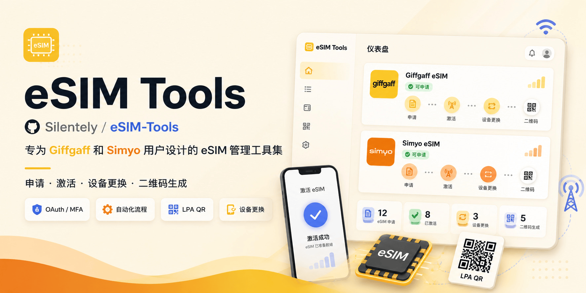

<div align="center">
<h1 align="center">eSIM Tools 🚀<br></img></h1>
</img>
<br>


<br>


<br>
[:cn: 中文版本](./README.md)
<br>
</div>

<p align="center">
  
</p>

## 📱 What is this?

**eSIM Tools** is a free online toolkit that helps **existing Giffgaff or Simyo subscribers**:

- 🔄 Convert physical SIM cards to eSIM (no card replacement needed)
- 📲 Quickly transfer eSIM when changing devices
- 📷 Generate eSIM QR codes for instant activation

> 💡 **Complete in 1-2 minutes**, no customer service contact needed, fully automated

---

## ✨ Who is this for?

### 🇬🇧 Giffgaff Users

✅ Have an existing Giffgaff number (UK carrier)
✅ Want to switch from physical SIM to eSIM
✅ Need to reactivate eSIM on a new device
❌ New users registering a number (must obtain number through official or third-party channels first)

### 🇳🇱 Simyo Users

✅ Have an existing Simyo number (Netherlands carrier, starting with 06)
✅ Need to change device or convert to eSIM
❌ New users registering a number (must register through official app first)

---

## 🚀 Quick Start

### Online Usage (Recommended)

**👉 Visit: [https://esim.cosr.eu.org](https://esim.cosr.eu.org)**

- ✅ No installation needed, ready to use
- ✅ Full feature support, regular updates
- ✅ Offline support, local data processing

### Usage Flow

#### 🇬🇧 Giffgaff (Recommended: SMS Verification Activation)

1. **Login** - Choose secure login method
2. **Email/SMS Verification** - Enter the verification code received
3. **SMS Verification Activation** - Enter 6-digit SMS code
4. **Get QR Code** - Automatically generated, scan to activate

> 📖 **Tutorial**: [Giffgaff User Guide](./docs/User_Guide_EN.md) (with video demo)

#### 🇳🇱 Simyo

1. **Account Login** - Enter phone number (starting with 06) and password
2. **Select Service** - Device change or retrieve existing eSIM
3. **Verification Code** - Enter SMS verification code
4. **Scan to Install** - Use the generated QR code on your new device

---

## 🖼️ Interface Preview

<details>
<summary>Click to view screenshots</summary>

### Home


### Giffgaff eSIM Tool


### Simyo eSIM Tool


</details>

---

## ❓ FAQ

### Giffgaff

<details>
<summary><strong>Q: Which activation method is recommended?</strong></summary>

**A**: "SMS Verification Activation" is recommended. Fully automated — just enter the SMS code and all steps complete automatically.
</details>

<details>
<summary><strong>Q: How long does it take?</strong></summary>

**A**: Usually 1-2 minutes. Send code → Enter code → Auto activation → Get QR code.
</details>

<details>
<summary><strong>Q: Is manual activation still available?</strong></summary>

**A**: No. Manual activation was officially disabled by Giffgaff on October 8, 2025. Please use SMS verification activation.
</details>

<details>
<summary><strong>Q: What if I accidentally close the page?</strong></summary>

**A**: After logging in again, the system resumes from recoverable points. It's recommended to keep the page open until activation completes.
</details>

<details>
<summary><strong>Q: When can I activate?</strong></summary>

**A**: Giffgaff service window is 04:30 - 21:30 UK time. Operations outside this window may fail. The UI shows local time vs UK time for reference.
</details>

<details>
<summary><strong>Q: Which devices are supported?</strong></summary>

**A**:

- **Apple**: iPhone XS/XR and newer, iPhone SE 2 and newer
- **Android**: Samsung Galaxy S20+, Google Pixel 3+, some OnePlus/Huawei models
- Check your device manual for detailed compatibility

</details>

### Simyo

<details>
<summary><strong>Q: Which phone number formats are supported?</strong></summary>

**A**: Only Dutch mobile numbers (10 digits starting with 06).
</details>

<details>
<summary><strong>Q: What if I cannot receive the verification code?</strong></summary>

**A**: You can choose the customer service verification option, or check your SMS blocking settings.
</details>

### Security & Privacy

<details>
<summary><strong>Q: Is my data safe?</strong></summary>

**A**:

- ✅ All data is processed locally in your browser, not uploaded to servers
- ✅ No passwords or sensitive information stored
- ✅ Open source and transparent, code is auditable
- ✅ Recommended to use in a secure network environment

</details>

---

## 🎁 New User Offers

If you don't have a number yet, register through these links to get bonus credit:

- **🇳🇱 Simyo users**: New SIM activation gets [extra €5 credit](https://vriendendeal.simyo.nl/prepaid/AZzwPzb)
- **🇬🇧 Giffgaff users**: New SIM activation gets [extra £5 credit](https://www.giffgaff.com/orders/affiliate/mowal44_1653194386268)

> ⚠️ **Note**: This tool does not support new number registration. It only supports eSIM conversion and device changes for existing subscribers.

---

## 🛠️ Local Deployment (Developers)

<details>
<summary>Click to view deployment instructions</summary>

### Quick Start

```bash
# 1. Clone repository
git clone https://github.com/Silentely/eSIM-Tools.git
cd eSIM-Tools

# 2. Install dependencies
npm install

# 3. Configure environment variables
cp env.example .env
# Edit .env to fill in required configuration

# 4. Start development server
npm start

# 5. Visit http://localhost:3000
```

### Requirements

- **Node.js** >= 18.0.0
- **npm** >= 8.0.0
- **Modern browser**: Chrome 88+, Firefox 85+, Safari 14+, Edge 88+

### Netlify Deployment

1. Fork this repository to your GitHub account
2. Connect the GitHub repository in [Netlify](https://app.netlify.com)
3. Build settings:
   - Build command: `npm run build`
   - Publish directory: `dist`
4. Configure environment variables (refer to `env.example`)
5. Deploy complete

</details>

---

## 📚 Documentation

- **User Guides**
  - [Giffgaff User Guide](./docs/User_Guide_EN.md) | [中文](./docs/User_Guide.md)

- **Technical Reference** (Developers)
  - [Architecture](./docs/ARCHITECTURE.md)
  - [Giffgaff Technical Reference](./docs/reference/README_giffgaff_esim_EN.md) | [中文](./docs/reference/README_giffgaff_esim.md)
  - [Simyo Technical Reference](./docs/reference/README_simyo_esim_EN.md) | [中文](./docs/reference/README_simyo_esim.md)
  - [CORS Solutions](./docs/guides/CORS_SOLUTION.md)

---

## 🔧 Technical Features

- 🚀 **Minimalist Design** - Native JavaScript, no framework dependencies, small bundle size
- ⚡ **Fast Response** - Global CDN acceleration, first contentful paint < 1.2s
- 🔒 **Privacy & Security** - All data processed locally, nothing uploaded to servers
- 📦 **Offline Ready** - Works offline, network fluctuations don't affect operations
- 🎯 **Modern Standards** - PWA, Web Vitals optimized, mobile-friendly

> 💻 **Developer Documentation**: See [Technical Architecture](./docs/ARCHITECTURE.md) for implementation details

---

## 🤝 Contributing

Contributions and suggestions are welcome!

### How to Contribute

1. 🍴 Fork the repository
2. 🌿 Create a feature branch (`git checkout -b feature/AmazingFeature`)
3. 💾 Commit following the convention (`git commit -m '✨ feat(core): add QR code caching'`)
4. 📤 Push your branch (`git push origin feature/AmazingFeature`)
5. 🔃 Open a Pull Request

### Commit Convention

```bash
# Format: <emoji> <type>(scope): <description>
✨ feat(auth): add automatic session renewal
🐛 fix(simyo): fix verification code retry logic
📝 docs(readme): update installation instructions
```

**Available Commands**:

- `npm run hooks:install` - Install Git hooks
- `npm test` - Run tests
- `npm run quality-check` - Code quality checks
- `npm run security-check` - Security scan

---

## 📞 Support & Feedback

If you encounter issues or have suggestions:

- 📋 [Submit an Issue](https://github.com/Silentely/eSIM-Tools/issues)
- 📖 View [Project Documentation](./docs/)
- 💬 Join community discussions

---

## 📈 Star History


---

## 📄 License

- **Code**: [MIT License](LICENSE)
- **Documentation**: [CC BY-NC-SA 4.0](https://creativecommons.org/licenses/by-nc-sa/4.0/deed.zh)
  - Free to copy and redistribute, but must **provide original author attribution** and **license notice**
  - **Not for commercial use** (any profit-generating activity is considered commercial use)

---

## ⚖️ Disclaimer

<p align="center">
  
</p>

**This tool is for learning and personal use only**. Please comply with relevant terms of service. The developer is not responsible for any issues caused by using this tool. Please use in accordance with local laws and regulations.

---

<div align="center">
  <sub>Made with ❤️ by <a href="https://github.com/Silentely">Silentely</a></sub>
</div>
