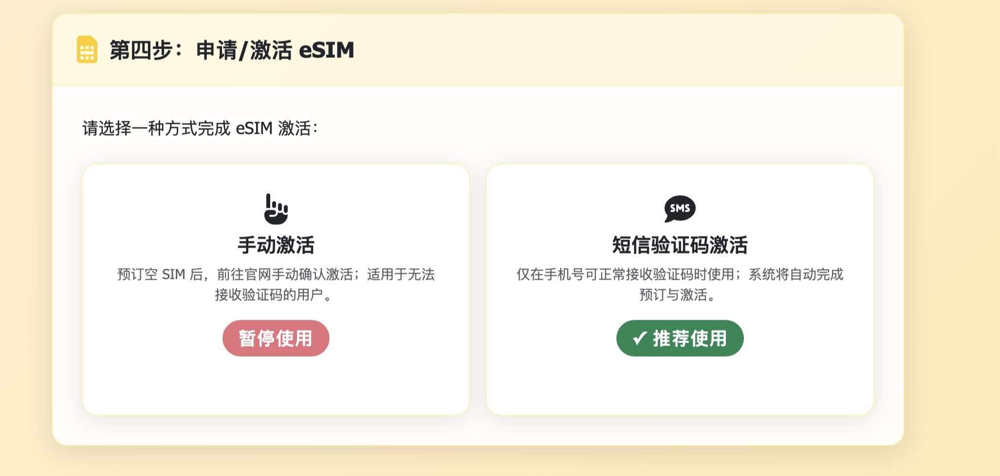
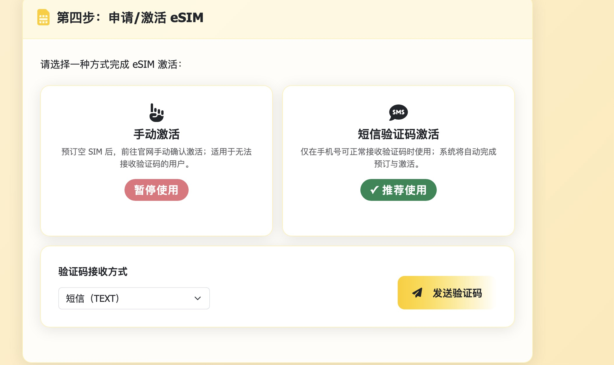
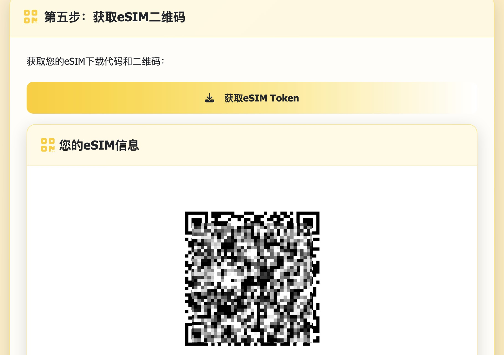
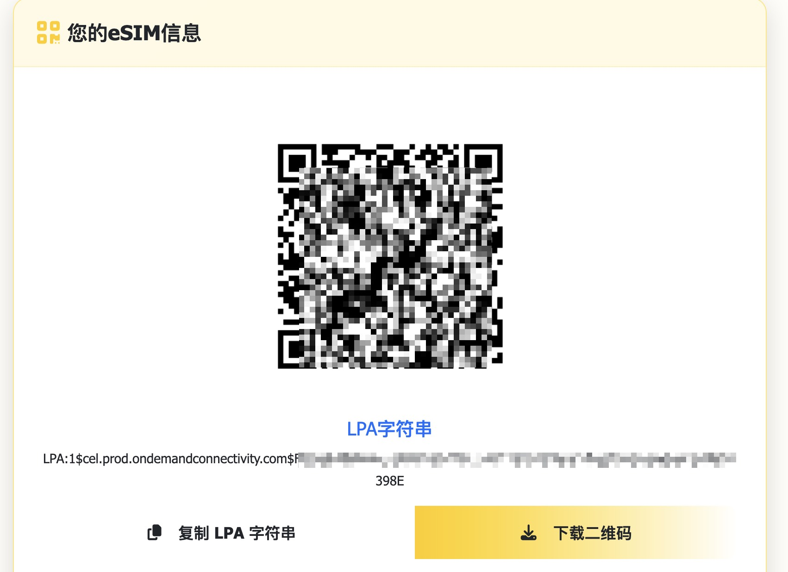

# giffgaff 使用教程

> 🎬 视频教程 - giffgaff eSIM更换操作演示

<video controls preload="metadata" width="100%" style="max-width: 800px; height: auto; border-radius: 8px; box-shadow: 0 4px 8px rgba(0,0,0,0.1);">
  <source src="https://github.com/user-attachments/assets/306dacb4-0a06-4930-bf35-3711d0f63720" type="video/mp4">
  您的浏览器不支持视频播放，请<a href="https://github.com/user-attachments/assets/306dacb4-0a06-4930-bf35-3711d0f63720">点击这里</a>下载视频。
</video>

[giffgaff.webm](https://github.com/user-attachments/assets/d4fbd0ff-b8bc-4477-a0c4-45698fe4802c)

## 1. 打开giffgaff的eSIM更换网页

访问eSIM Tools网站，选择Giffgaff eSIM工具。

## 2. 选择登录方式

选择 OAuth 或者 Cookies 方式登录（推荐 OAuth 方式）

### OAuth方式登录

OAuth方式需要获取回调URL，获取方式参考页面说明：

1. 点击"使用 OAuth 登录"按钮
2. 在新打开的网页中输入giffgaff用户名和密码并点击登录（请提前打开浏览器开发者工具的网络面板）
3. 输入邮件验证码
4. 在开发者工具的网络面板中找到回调URL（格式为：`giffgaff://auth/callback/?code=ABC123&state=XYZ789`）

5. 将获取到的回调URL输入到eSIM更换网页相应的输入框中，点击"处理回调"

## 3. MFA认证

处理回调后会自动跳转到第二步，选择邮件/手机验证码方式获取MFA认证：

输入获取到的验证码，点击"验证"：

## 4. 获取会员信息

验证通过后会自动跳转到第三步，获取giffgaff会员信息页面：

点击"获取会员信息"，跳转到第四步申请/激活eSIM：

## 5. 选择并激活eSIM

选择短信验证码激活并输入短信验证码，会自动完成更换eSIM并生成QR码和LPA信息：

交换成功将跳转第五步显示QR码和LPA信息：

## 6.  使用原生eSIM手机完成扫码
