# giffgaff 使用教程

> 🌐 [English Version](./User_Guide_EN.md)

> 🎬 视频教程见文末（视频教程未更新，OAuth 获取回调 URL 方式请以文字教程为准）

## 1. 打开giffgaff的eSIM更换网页

访问eSIM Tools网站，选择Giffgaff eSIM工具。

## 2. 选择登录方式

选择 OAuth 或者 Cookies 方式登录（推荐 OAuth 方式）

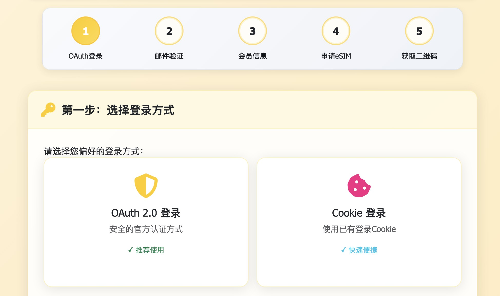

### OAuth方式登录

OAuth方式需要获取回调URL，获取方式参考页面说明：

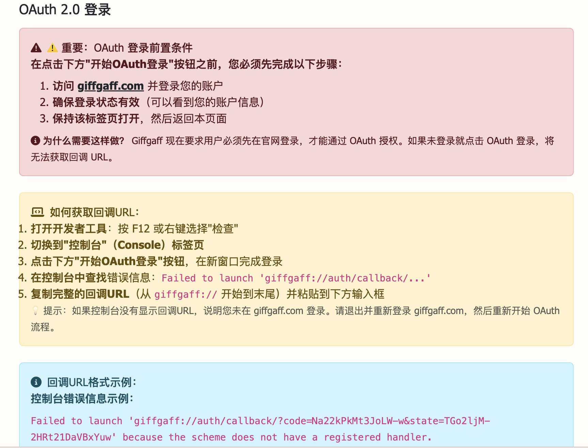

1. 首先请在新标签页打开giffgaff官网的登录页面：'https://www.giffgaff.com' 进行登录
2. 登录完成后返回eSIM更换页面，打开开发者工具：按 F12 或右键选择"检查"切换到"控制台"（Console）标签页
3. 点击下方"开始OAuth登录"按钮，新窗口打开后切换回eSIM更换页面
4. 在控制台中查找错误信息：Failed to launch 'giffgaff://auth/callback/...'，复制该行中的回调URL

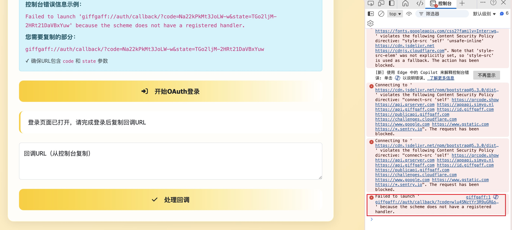

5. 将获取到的回调URL输入到eSIM更换网页相应的输入框中，点击"处理回调"

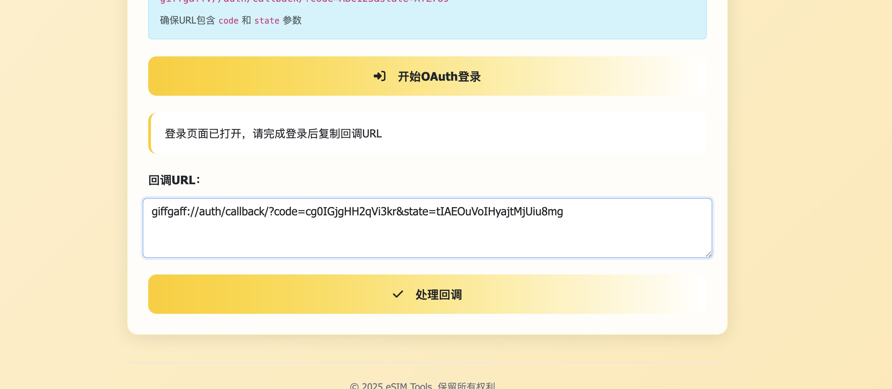

## 3. MFA认证

处理回调后会自动跳转到第二步，选择邮件/手机验证码方式获取MFA认证：

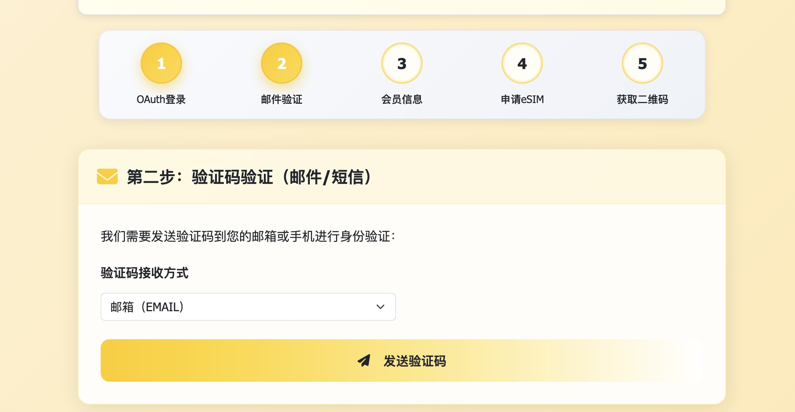

输入获取到的验证码，点击"验证"：

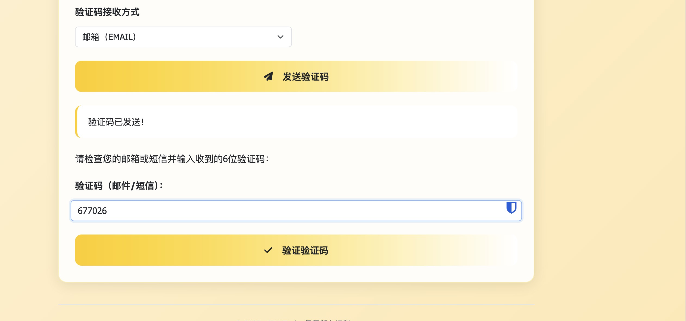

## 4. 获取会员信息

验证通过后会自动跳转到第三步，获取giffgaff会员信息页面：

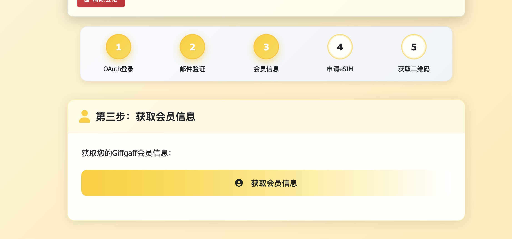

点击"获取会员信息"，跳转到第四步转换/激活eSIM：

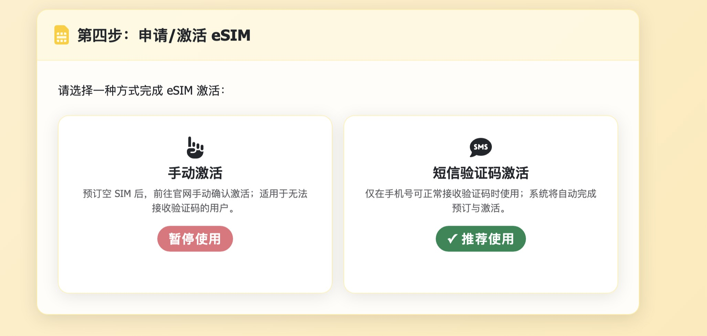

## 5. 选择并激活eSIM

第四步提供三种激活方式，请根据自身情况选择：

### 方式一：短信验证码激活（推荐）

选择短信验证码激活并输入短信验证码，会自动完成更换eSIM并生成QR码和LPA信息：

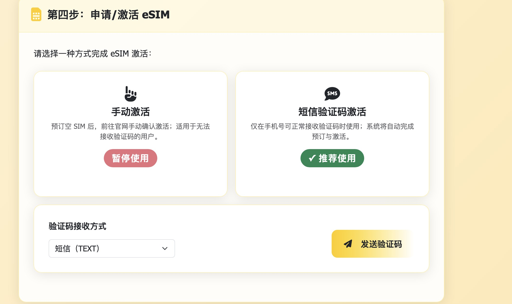

### 方式二：已支付直取 eSIM（新购用户专用）

> ⚠️ 作者因条件不符未能实测此功能。如遇到问题，请打开浏览器开发者工具（F12 → Console），复制完整日志后到 [GitHub Issues](https://github.com/Silentely/eSIM-Tools/issues) 提交反馈。

如果您已在 Giffgaff 官方 App 完成 10 英镑付款，但 App 未成功生成 eSIM，可以选择此方式：
1. 点击"已支付直取 eSIM"卡片
2. 点击"拉取我的 eSIM"按钮
3. 系统将直接拉取账户上已存在的 eSIM 并生成二维码
4. 如果账户存在多个可下载的 eSIM，系统会显示选择列表，请选择需要的 eSIM 后点击确认

此方式无需短信验证码，跳过 `reserveESim` / `swapSim` 流程，直接获取 QR 码。

### 方式三：手动激活（已暂停）

官方已暂停手动激活通道，请使用上述两种方式。

交换成功将跳转第五步显示QR码和LPA信息：

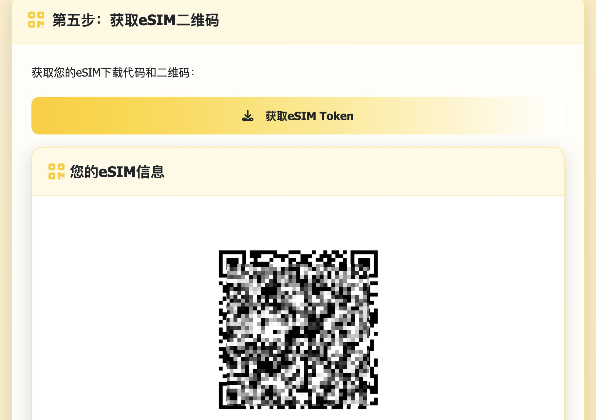
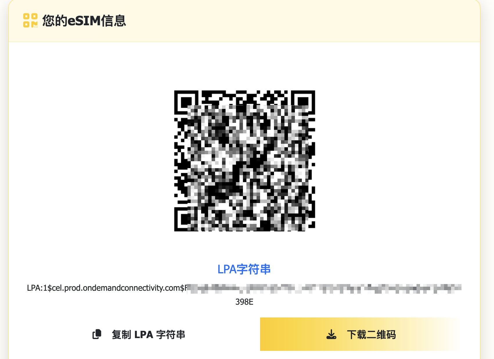

## 6. 使用原生 eSIM 手机完成扫码

1. 打开手机的**设置** → **蜂窝网络** / **移动网络**
2. 选择**添加 eSIM** / **扫描二维码**
3. 扫描页面上显示的 QR 码
4. 确认安装，等待 eSIM 激活完成
5. 激活成功后可在蜂窝网络设置中看到新的号码

---

## 附录：视频教程

> ⚠️ 视频教程未更新，其中 OAuth 获取回调 URL 的方式请以上方文字教程为准。

<video controls preload="metadata" width="100%" style="max-width: 800px; height: auto; border-radius: 8px; box-shadow: 0 4px 8px rgba(0,0,0,0.1);">
  <source src="https://github.com/user-attachments/assets/306dacb4-0a06-4930-bf35-3711d0f63720" type="video/mp4">
  您的浏览器不支持视频播放，请<a href="https://github.com/user-attachments/assets/306dacb4-0a06-4930-bf35-3711d0f63720">点击这里</a>下载视频。
</video>

[giffgaff.webm](https://github.com/user-attachments/assets/d4fbd0ff-b8bc-4477-a0c4-45698fe4802c)
