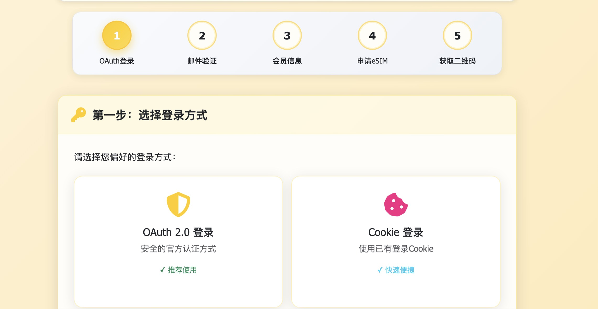
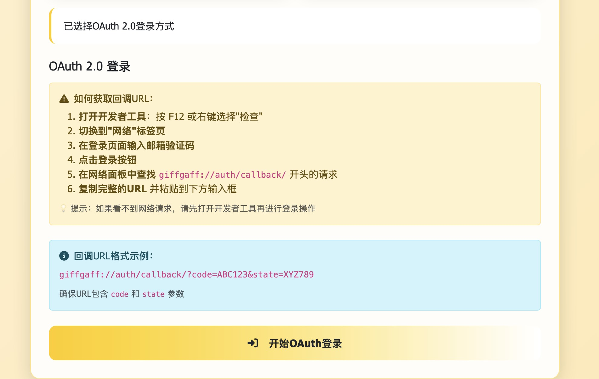
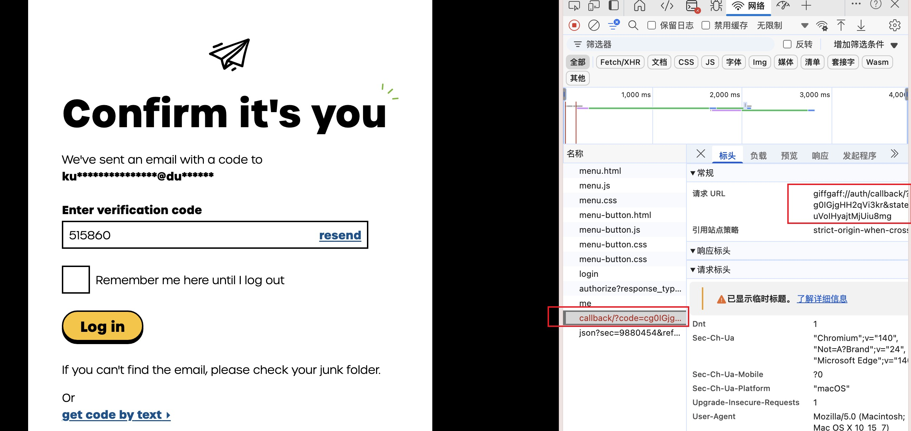

# giffgaff 使用教程

## 1. 打开giffgaff的eSIM更换网页

访问eSIM Tools网站，选择Giffgaff eSIM工具。

## 2. 选择登录方式

选择 OAuth 或者 Cookies 方式登录（推荐 OAuth 方式）

### OAuth方式登录

OAuth方式需要获取回调URL，获取方式参考页面说明：

1. 点击"使用 OAuth 登录"按钮
2. 在新打开的网页中输入giffgaff用户名和密码并点击登录（请提前打开浏览器开发者工具的网络面板）
3. 输入邮件验证码
4. 在开发者工具的网络面板中找到回调URL（格式为：`giffgaff://auth/callback/?code=ABC123&state=XYZ789`）

5. 将获取到的回调URL输入到eSIM更换网页相应的输入框中，点击"处理回调"

## 3. MFA认证

处理回调后会自动跳转到第二步，选择邮件/手机验证码方式获取MFA认证：

输入获取到的验证码，点击"验证"：

## 4. 获取会员信息

验证通过后会自动跳转到第三步，获取giffgaff会员信息页面：

点击"获取会员信息"，跳转到第四步申请/激活eSIM：

## 5. 选择并激活eSIM

选择手动激活并选择预定eSIM，会自动预定新空卡：

然后按照提示打开激活页面进行操作：

在激活页面输入上一步获取到的6位激活码并点击"激活"：

然后会跳转新页面确认旧卡信息和新卡信息：

再次确认信息：

## 6. 完成激活

会跳转到giffgaff首页，此刻返回eSIM更换网页，点击"我已完成手动激活，继续下一步"。

会自动跳转到第五步，获取eSIM的LPA信息和QR码。