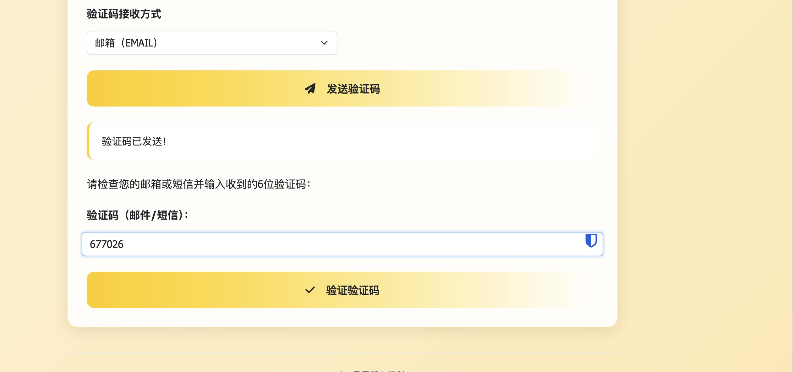

# Giffgaff User Guide

> 🎬 Video Tutorial - Giffgaff eSIM Replacement Operation Demo

Your browser does not support video playback. Please [click here](https://github.com/user-attachments/assets/306dacb4-0a06-4930-bf35-3711d0f63720) to download the video.

[giffgaff.webm](https://github.com/user-attachments/assets/d4fbd0ff-b8bc-4477-a0c4-45698fe4802c)

## 1. Open Giffgaff eSIM Replacement Web Page

Visit the eSIM Tools website and select the Giffgaff eSIM tool.

## 2. Select Login Method

Choose OAuth or Cookies login method (OAuth method is recommended)

### OAuth Login

OAuth method requires obtaining the callback URL. For instructions on how to get it, please refer to the page instructions:

1. First, open the login page for the giffgaff website on a new tab: `https://www.giffgaff.com` and log in.
2. After logging in, return to the eSIM replacement page and open the developer tools: press F12 or right-click and select “Inspect” to switch to the “Console” tab.
3. Click the “Start OAuth Login” button at the bottom; once the new window opens, switch back to the eSIM replacement page.
4. Look for the error message in the console: “Failed to launch ‘giffgaff://auth/callback/…’”. Copy the callback URL from that line.

5. Enter the obtained callback URL into the corresponding input box on the eSIM replacement page and click "Process Callback"

## 3. MFA Authentication

After processing the callback, you will be automatically redirected to the second step, select email/SMS verification code method to obtain MFA authentication:

Enter the obtained verification code and click "Verify":

## 4. Get Member Information

After successful verification, you will be automatically redirected to the third step, the get Giffgaff member information page:

Click "Get Member Information" to go to the fourth step of applying/activating eSIM:

## 5. Select and Activate eSIM

Select SMS verification code activation and enter the SMS verification code, the system will automatically complete the eSIM replacement and generate QR code and LPA information:

After successful exchange, you will be redirected to the fifth step showing QR code and LPA information:

## 6. Use Native eSIM Phone to Complete Scanning